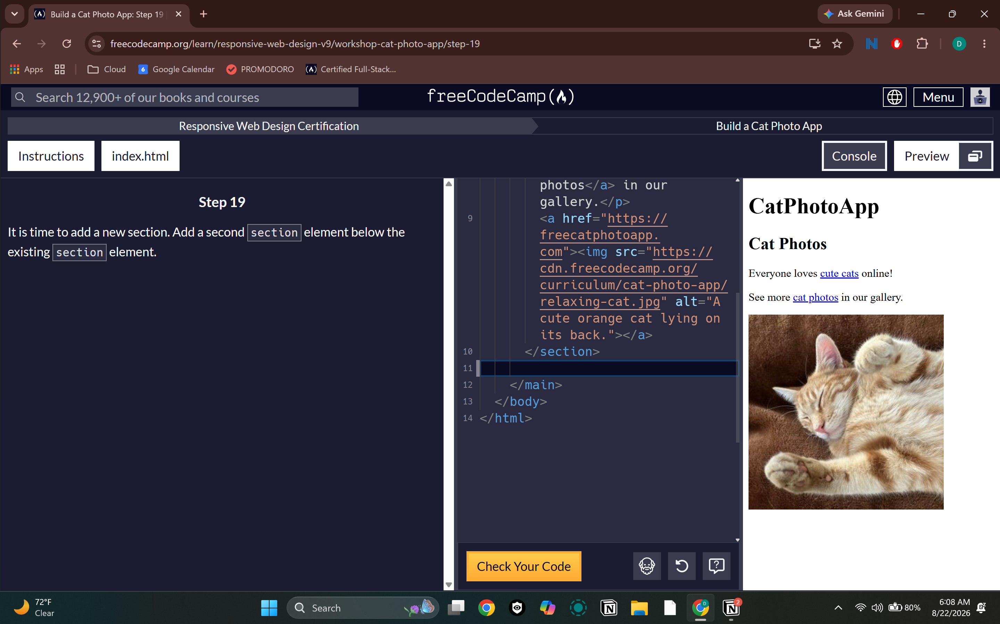
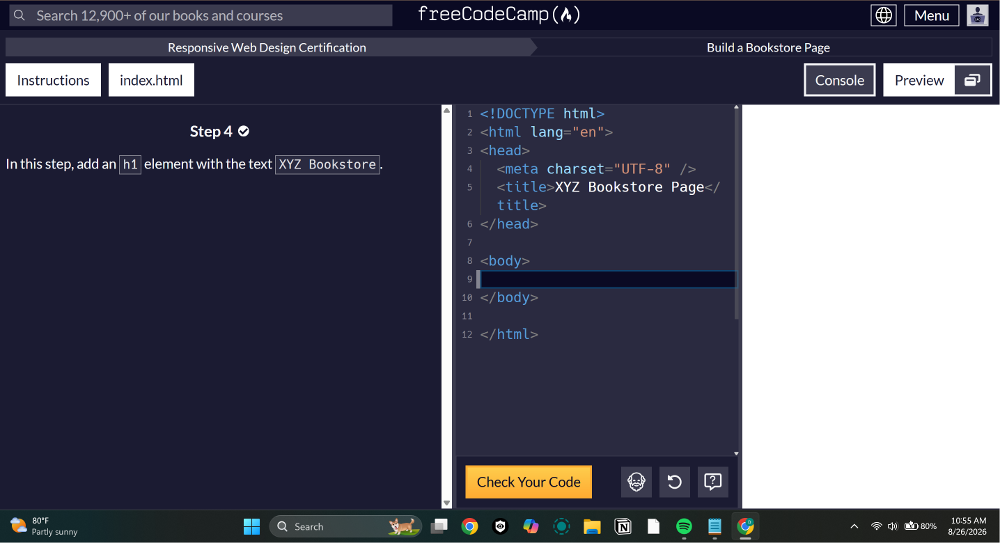

# Day 003 — Finished Cat Photo App + Started Bookstore 📚

**Date:** August 26, 2026

## 📚 What I Learned

* I learned more about how HTML is structured and how everything goes together.
* I got more practice with lists, links, images, sections, and attributes.
* I'm starting to understand where different elements are supposed to go instead of just guessing.
* I also learned more about nesting elements correctly.

## 💻 What I Practiced

* Finished the **Cat Photo App** on freeCodeCamp 🎉
* Started working on the **Bookstore**.
* Practiced finding mistakes in my code and figuring out what I did wrong.
* Got more comfortable writing HTML without having to look everything up.

## 🧠 Key Takeaways

* The order you put your HTML elements in matters.
* Closing tags are important and I'm getting better at remembering them.
* A lot of coding is figuring out why something isn't working and fixing it.
* I'm definitely starting to understand HTML more than when I started.

## 🤔 What I Struggled With

* I still sometimes put elements in the wrong order.
* I have to remind myself to check my closing tags.
* Sometimes I know what I want the code to do but have to figure out how to actually write it.

## 🚀 Progress

**Cat Photo App** ✅ Finished
**Bookstore** 🔄 Currently working on it

**Next:** Finish the Bookstore and keep getting better with HTML.

## 📸 Screenshots

### Cat Photo App 

### Bookstore 

