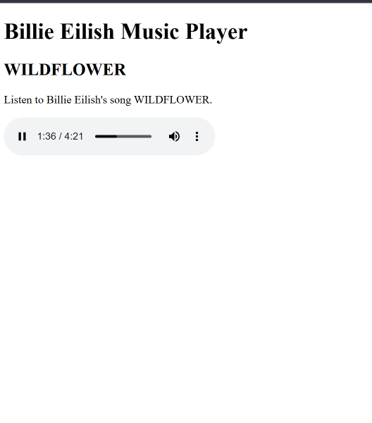

# Day 005 — HTML Audio & Media 🎵

## What I Worked On

Today I continued learning HTML through freeCodeCamp's Responsive Web Design course.

I worked on:

- ✅ Understanding HTML audio and video elements
- ✅ Build an HTML Music Player
- 🔄 Build an HTML Video Player

After completing the music player lesson, I practiced the concept on my own by building a simple Billie Eilish music player.

## What I Learned

### HTML Audio

I learned how to add audio directly to a webpage using the `<audio>` element.

Example:

<audio src="audio-file.mp3" controls></audio>

